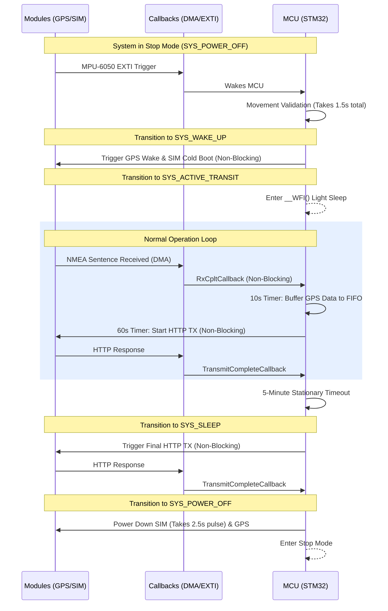
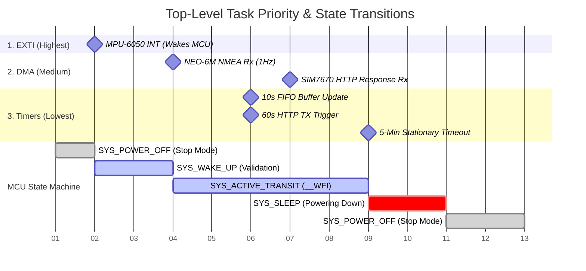
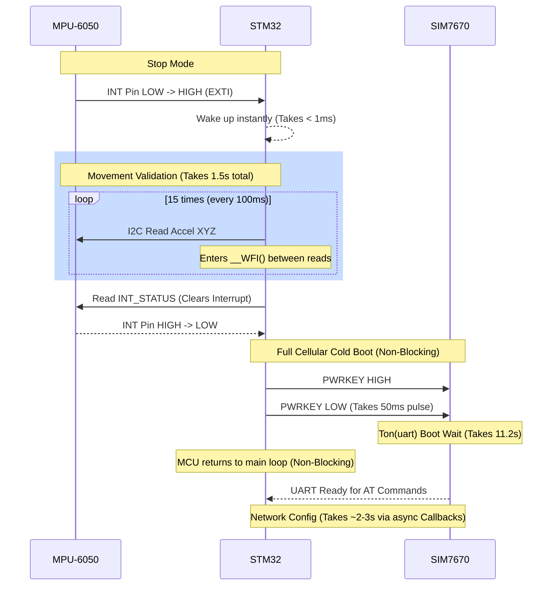
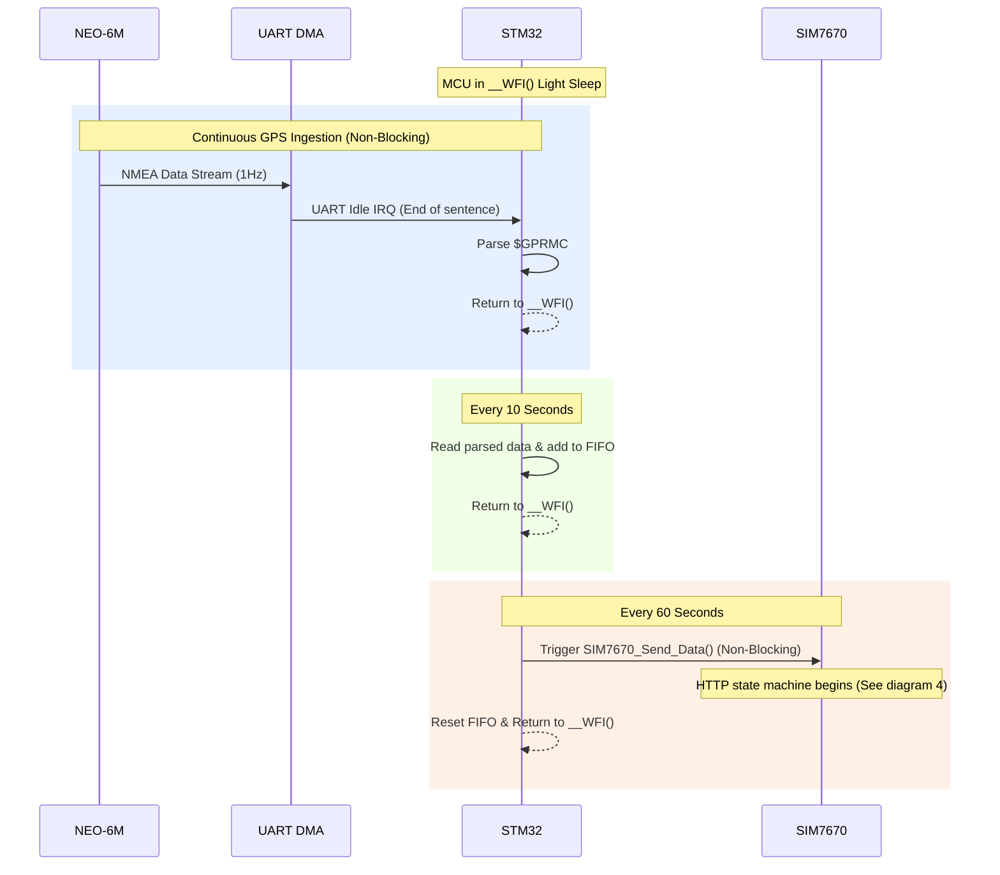
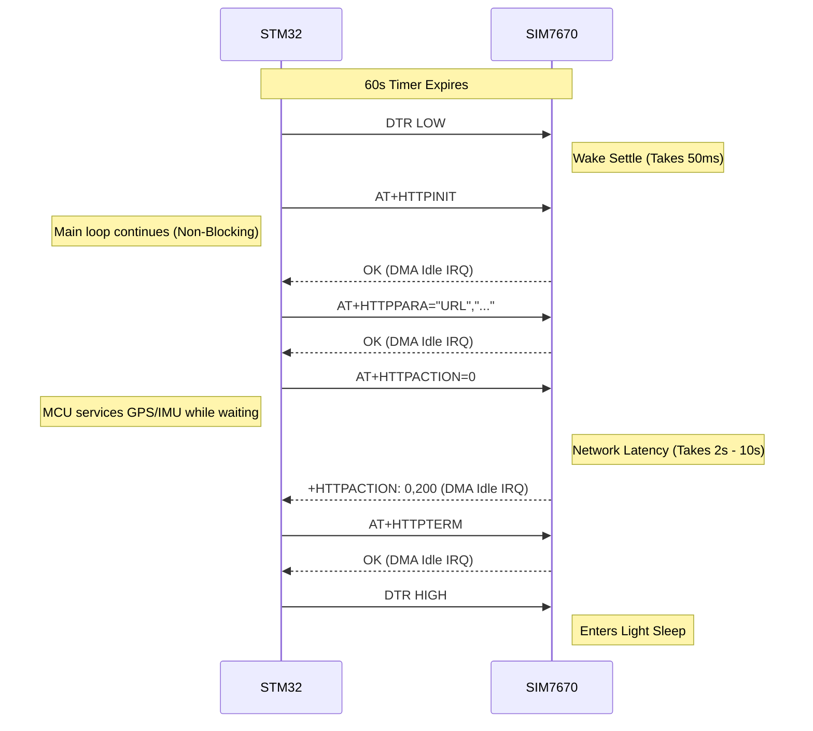
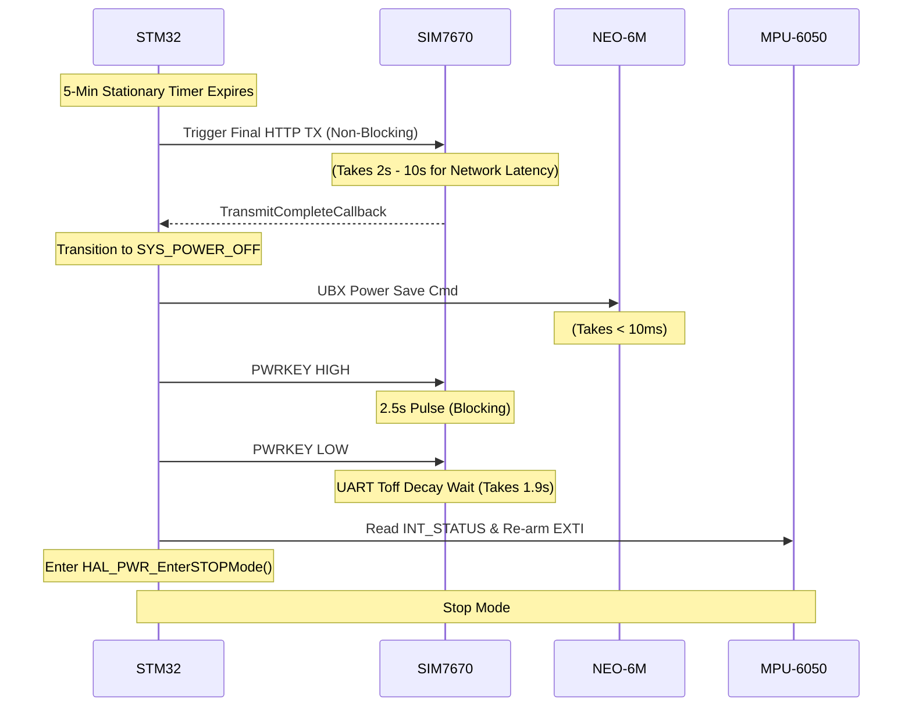

# System Timing Diagrams & Timelines

This document outlines the timing requirements, hardware pin states, and processing windows for the tracking device system. I have updated these to use Sequence Diagrams throughout, ensuring the non-blocking architecture and callbacks are clearly visible.

---

## 1. Top-Level System Sequence (The Big Picture)
This shows how the system transitions through its high-level states (`SYS_POWER_OFF` → `SYS_WAKE_UP` → `SYS_ACTIVE_TRANSIT` → `SYS_SLEEP`), highlighting how tasks are handed off to callbacks.

### Top-Level Abstract Gantt Chart
This Gantt chart shows an abstract timeline of the MCU states mapped against the priority levels of the interrupts and callbacks that drive the transitions.

---

## 2. Wake-up & Movement Validation (Task 2)
Detailed view of what happens exactly when the car starts moving from a cold state (Stop Mode). Note that the entire cellular cold boot sequence is non-blocking.

* **Pin States:**
  * `MPU_INT` (PB8): Transitions `LOW → HIGH`. Remains HIGH until `INT_STATUS` is read at the end of validation.
  * `SIM_PWRKEY` (PB0): Was LOW. Once validation passes, transitions `LOW → HIGH → LOW` to trigger the boot pulse (Takes 50ms).

---

## 3. Active Transit Loop: Normal Operation (Task 3 & 5)
During normal tracking, the MCU sleeps continuously in `__WFI()`. It is woken briefly by DMA interrupts to parse GPS data, and executes timer-based events to buffer the FIFO and send payloads.

---

## 4. SIM7670 Non-Blocking HTTP Transmission
This details the non-blocking state machine for the cellular modem. The MCU does *not* wait in a `while()` loop for `OK`. It sends the command and yields.

---

## 5. Sleep & Power-Down Routine (Task 6)
Detailed view of how the system safely powers down. Note that the final HTTP transaction is non-blocking, but the `PWRKEY` pulse logic acts as a final blocking guard before sleep.

* **Pin States:**
  * `SIM_PWRKEY` (PB0): Normally LOW. Transitions `LOW → HIGH → LOW` to form a 2.5-second pulse.
  * `MPU_INT` (PB8): Cleared, then re-armed for high threshold.

---

## 6. Hardware Module Wake/Sleep Specifications

The following diagrams show the raw hardware-level timing constraints for each module. The timings listed below have been verified against the respective datasheets and dictate the buffers and timeouts used in our top-level C code.

### SIM7670C Cellular Module

**Power-On Sequence**
Takes **11.2 seconds** from the power-on issue until the UART port is ready to accept commands and the `STATUS` pin outputs a high level.

**Power-Off Sequence**
Takes **1.9 seconds** for the UART interface to fully shut down. A minimum buffer time of 2 seconds is strictly required before initiating a new power-on sequence.

### u-blox NEO-6M GPS

**Hot Start (V_BCKP Maintained)**

**Cold Start (Total Power Loss)**

**Sleep Mode (Software Power Save)**
Sending the `UBX-RXM-PMREQ` command over UART immediately forces the GPS into a low-power backup state (provided `V_BCKP` is active) within ~10ms.

### MPU-6050 IMU

**Sleep Mode Exiting**
The internal Phase-Locked Loop (PLL) requires between 1ms and 10ms to settle. The gyroscope Zero-Rate Output (ZRO) requires 30ms to fully settle from power-on before providing accurate readings.

### STM32 MCU (System Controller)

**Stop Mode Exiting**
Entering Stop Mode stops the core clock. Waking requires waiting for the HSI oscillator to stabilize (typically ~5.4µs for the STM32F1xx series).

---

## 7. System Power Profile

The graph below visualizes the system's power consumption over an 8-minute window. It clearly demonstrates the massive difference between the transient active spikes (like the SIM boot and cellular transmission) and the highly efficient baseline sleep states while parked. 

